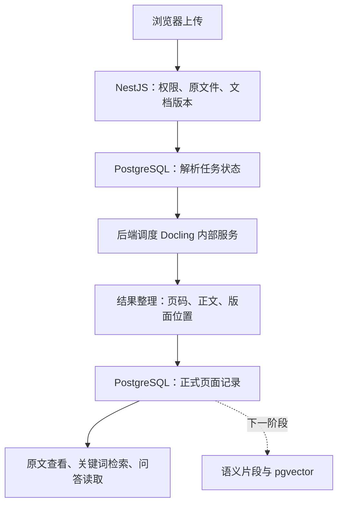

# Docling PDF 按页识别与存储 v1

Status: complete locally — M0–M4 和 A01–A15 已通过；本地可审查，未推送或部署。验收记录见 doc/qa/docling-pdf-pages-verification.md。
Date: 2026-10-01
Scope: 本地实现、真实解析验证、回归及可审查交付；生产发布单独安排。
启动文本：[目标模式 prompt](docling-pdf-pages-goal.md)。

## 1. 目标与完成后的行为

用户上传文字型、扫描型或混合 PDF 后，LabRat 通过自部署 Docling 完成识别，
按物理页保存完整正文、必要的结构和原图位置。处理状态可跨刷新读取，任务中断
可恢复或明确重试；问答按页或页内连续窗口读取，引用能打开当时版本的原始页面。

完成本目标需要真实 Docling、数据库和浏览器证据。仅启动容器、得到 Markdown、
通过替身测试或完成一个里程碑，都不构成本目标完成。

本版包括：PDF 解析接入、页面数据结构、任务恢复、精简问答载荷、页面引用、
已诊断的 token 预算计量修复。后续再做语义切分、embedding 和 pgvector；
本版的检索使用关键词/原文匹配，语义索引从已保存页面派生。

## 2. 已确认背景和实施基线

- 当前计划位于本对话已附加的工作树：
  `C:/Users/liuha/.codex/worktrees/frontend-routing-phase1/LabRat-blank`。
  编写时 HEAD 为 `8946d90`，包含 routing 工作及 `origin/main 933c5fc`。
  执行时重新检查实际分支和 main，不能把这个记录当作永远最新。
- 主目录 `D:/project/LabRat-blank` 有大量独立改动和较旧文档。保护这些内容。
  优先复用合适的已附加工作树；若需要另一工作树，先检查附加状态和占用，
  按宿主工作树工具流程处理。只迁移本计划材料，不能覆盖另一 checkout 的整份进度。
- 已有本地诊断材料及其 PROGRESS 修改属于本次后续工作的依据，应保留。
  旧任务的发布授权不适用于此目标。
- PDF 实际为 11 页，旧解析器产生 1,244 个片段，全部来自文字层。
  线上失败时累计实际用量为 19,999 tokens；按请求字节预留 token 和逐行碎片
  共同导致低效及提前停止。重复页签不是缺页证据。
  详见[诊断报告](../qa/pdf-reading-limit-diagnosis-2026-10-01.md)。

进入实施时读取 `AGENTS.md`、`README.md`、`doc/START_HERE.md`、
`doc/plan.md`、`doc/current-milestone.md`、`doc/task-checklist.md`，
以及以下现行契约：

- `doc/contracts/backend-api-v1.openapi.yaml`
- `doc/contracts/authorization-v1.md`
- `doc/contracts/scientific-invariants-v1.md`
- `doc/contracts/research-qa-v1.md`
- `doc/contracts/canonical-data-dictionary.md`
- `doc/arch/architecture.md`、`doc/arch/ai-boundaries.md`

研究问答的当前 source-trace 约定优先于旧计划中的逐字/数字回答验收规则。
本计划要求核对解析后的原文质量，不重新引入模型回答的通用逐字或数字过滤器。

## 3. 架构与职责

### Docling 服务

使用现成 `docling-serve` 的文件上传、异步状态和结果接口。首选本地 standard
PDF pipeline，原生文字提取与本地 OCR 配合；默认不启用远程模型、图片描述或
生成式科学数据提取。M0 验证实际版本支持及输出后固定镜像、模型和配置。

- 只开放给后端；通过文件字节提交，不能要求把用户文件公开成 URL。
- 配置服务认证、文件/页数/输出大小、CPU/内存和时间限制。禁止读取文档中的外部链接。
- 模型在部署准备时下载并固定校验信息，正常识别不依赖临时联网下载。
- 第一版默认单解析并发、CPU 起步；记录耗时和峰值内存后再调整资源。
- Docling 只负责识别及版面分析；原文件、项目权限和最终记录由 LabRat 管理。
- 当前 Docling 代码为 MIT；固定版本后核对实际用到的模型和依赖许可，
  保留必要版权及许可文件。不能仅以主仓库 MIT 推定全部模型都采用 MIT。

### 后端调度与恢复

复用现有 DocumentVersion 状态和处理租约作为任务归属，补齐 Docling task ID、
尝试次数、下次重试时间及错误摘要等运行字段；字段定义写入迁移和契约，
不塞进每页 metadata。数据库是持久状态，内存 Map 只承担当前连接/执行控制。

浏览器提交后立即得到文档版本与状态，轮询不启动新的解析。后端启动时检查尚未
结束的任务：Docling 任务仍存在就继续查询；任务丢失或结果过期则在总尝试上限内
重新提交。默认最多 3 次总尝试，并有超时和退避；不可读、加密、超限及权限错误
不自动重试。明确展示正在处理、部分成功、失败及中断，不伪造按页实时进度。

一次只允许一个有效租约。提交结果时核对版本、原文件哈希、处理配置和尝试身份，
过期尝试的迟到结果不能覆盖当前状态。归档或权限撤销后停止提交/持久化；
即使上游任务无法取消，也必须丢弃其迟到结果并限制临时文件生命周期。

恢复时重新检查原发起人的账号和当前项目权限，不复用序列化的旧授权对象。
遵守现有会话有效性约定；无法满足时显示可由当前有权限用户显式重试的中断状态。

### 结果整理模块

读取 Docling 的结构化 JSON，根据来源页码、阅读顺序、字符范围和坐标整理页面，
不依靠对整份 Markdown 猜测分页。跨页内容按真实来源拆分；缺少细粒度坐标时
降级到页级定位并标明，不编造精确高亮。

统一正文编码为 UTF-8，保持科学符号、大小写、上下标、负号及单位含义。
清理空白、页眉页脚或断行时必须可追踪，不能用通用字符替换悄悄改变数值。
区分正文与页眉页脚，但保留源内容和原图。保留表格行列关系及公式区域；
无法可靠恢复的结构明确标记，不生成补齐数据。

规范化后的字符位置统一使用 UTF-16 code units 的半开区间 `[start,end)`，
与现有 JavaScript 前后端一致；上游 Python 字符偏移必须转换或重新计算。
坐标统一为现有查看器的、考虑显示旋转的左上角归一化坐标。

## 4. 数据保存与最小 metadata

演进现有 `context_document_pages` 成为新版本 PDF 的正式页面表，
为新格式添加可识别的 schema/processing 版本。现有旧页面检查点及历史 passage
保留原含义。迁移追加新编号，不修改已经发布的历史迁移。

| 层级 | 保存内容 | 避免的重复 |
| --- | --- | --- |
| 文档/版本 | 原文件引用、哈希、处理版本、模型/配置摘要、总页数 | 每页不重复文件名、哈希、引擎清单 |
| 页面 | 版本 ID + 物理页码、完整正文、尺寸/旋转、状态、质量摘要 | 正文仅有一份主要存储 |
| 页内块 | 稳定块 ID、类型、顺序、正文区间、必要坐标；可选表格结构 | 不逐块重复整页正文及公共属性 |
| 运行字段 | 尝试身份、上游任务 ID、期限、错误摘要 | 不混入页面正文及问答上下文 |

项目归属通过版本关联验证；用于权限过滤或索引的必要冗余列可以保留，
应注明理由，不为追求少字段牺牲隔离。OCR 分数或 Docling 质量分数只有实际提供时
才保存，并注明含义；缺失不能伪造为 1.0，也不能称为科学准确率。

每一物理页都有记录，空白页与失败页严格区分。纸面印刷页码是可选标签，
页面主键和引用使用从 1 开始的物理页码。独立读取原文件页数并与结果逐页核对。

旧的 4,000 字符 passage 限制不能截断页面存储。页面保留完整正文，
文件级现有大小/页数/总字符等限制继续显式执行，超限不能伪装为完整成功。

完整 Docling 结果允许压缩保存一次，使用受项目权限保护的文件存储及引用；
PostgreSQL 和问答只读规范化后的必要字段。避免在 metadata 内嵌 Base64 图片、
整个原始 JSON 或多种重复全文格式。必要的表格结构和审计证据不应为了压缩而丢弃。

## 5. 保存、重处理与历史引用

按页保存不要求每页独立解析：短文档可整份转换，再按页整理落库。
第一版必须支持任务级恢复，不宣称上游具备逐页流式检查点。

结果入库需要幂等；已成功保存且可引用的页面在同一处理版本内不可改写。
重试可重新计算整份 PDF，但复用已有成功页，仅补齐缺失/失败页。重复键内容冲突
应报告，不用覆盖或静默忽略掩盖正文变化。版本状态在一致的页面记录提交后更新。

解析器、模型、规范化/定位规则或重要配置变化，产生新的处理版本和 DocumentVersion。
使用原 FileObject 重新处理，无需用户重新上传；必须是显式的重处理动作，
不在迁移或普通读取时批量重识别历史文件。旧答案仍读取旧 passage/page 及冻结证据。

本计划实施时要同步更新原契约中的“仅 PDF.js/Tesseract.js”“不引入解析服务”
以及逐页检查点等描述，写清 Docling 是自部署服务、任务级恢复的实际能力。
不改变文档证据与已确认实验数据之间的审核边界。

## 6. 读取、问答与前端

- 新增页面目录和有界正文读取接口。现有 `/pages/{pageNumber}` 是原图接口，
  不改成 JSON；建议新增 `/pages` 和 `/pages/{pageNumber}/text`。
  在 OpenAPI 定义请求/响应、游标、页状态和版本，再生成客户端。
- 页面目录返回页码/状态等摘要。正文窗口使用原页位置和明确 nextCursor，
  不一次把整篇论文交给模型；以现有 4,000 字符读取上限为起点，
  按完整内容块尽量填满窗口，超长块可以连续切窗且不丢字。
- PDF 新版本检索查询正式页面，复用 PostgreSQL 关键词索引；化学式、
  型号及中文短语提供有界原文匹配。项目和选定版本条件在检索时落实。
- 问答证据冻结版本、页码、正文范围及实际返回文本；模型载荷默认仅包含
  evidence ID、页码、正文、必要质量提示和继续读取标记。
  文档标题/版本可在来源表中保存一次；坐标和审计信息留在服务端。
- 新页证据与旧 passage 证据都有显式分派和引用解析，旧证据 ID 不改写。
  同页多窗口的 UI 可以合并为“第 2 页 · 3 处”，但每个实际读取窗口和 trace 都保留，
  不把合并显示变成丢失历史证据。
- 前端继续使用现有原始 PDF 预览和高亮，提供页面正文/质量状态查看及必要重试。
  用户刷新页面和重新登录后能看到服务器保存的处理状态和结果。
- Word/TXT 继续使用现有解析路径；Excel 保持已确认区域和已接受快照的准入规则。

后续语义片段只需引用 `versionId + pageNumber + text spans`，跨页片段可有多个范围；
embedding 模型/维度/切分版本属于派生索引。第一版不创建向量索引或引入 RAG 平台。

## 7. 独立但必需的 token 预算修复

修复 `qaBudget.js` 将整个请求的 UTF-8 字节数当 token 预留的实现。
使用与实际 provider/model 匹配的计数方法或经样本校准且有安全余量的估计，
覆盖工具定义、消息历史和输出预留。不能把“除以 4”作为通用算法。

记录计量方式、预估输入、输出预留和真实 usage，避免记录完整私有请求。
区分 provider 的缓存字段含义，不能重复计数。缺少 usage/网络结果不确定时
保留合理预留并限制继续请求，不把未知用量当零。显式重试继承累计消耗。

保持当前 60,000 累计 token 等资源上限及到限后的 source-trace 行为。
本任务不以提高上限、清零计数或删除保护作为修复。真实耗尽仍应停止并保存已读证据。
具体 tokenizer/计数 API 和依赖在 M0 核验，并在 M3 用 provider 适配层测试验证。

## 8. 可连续执行的里程碑

| 里程碑 | 交付 | 离开该阶段所需证据 |
| --- | --- | --- |
| M0 基线与实测 | 检查 checkout/main、运行 preflight；固定 Docling/模型候选；建立样本及原文核对标签；真实运行 Docling | 11 页论文、扫描和混合样例的结构化结果可映射到页；保存耗时/内存、许可清单及明显缺陷。先冻结核对标签，不能按输出改答案 |
| M1 契约与页面存储 | 更新研究问答/OpenAPI/数据字典；追加迁移、页面记录和旧格式分派 | 实际隔离 PostgreSQL 验证升级、长页无截断、权限与旧引用；生成客户端一致 |
| M2 服务与任务 | Docling 内部服务配置、后端适配、规范化、持久状态和重启恢复 | 真实解析走完上传到落库；服务重启、重复提交、迟到结果和部分失败测试通过 |
| M3 阅读与问答 | 按页检索读取、精简载荷、token 计量、引用与页面 UI | 来源范围、游标、历史引用、真实/模拟预算边界及浏览器查看通过；不再因字节错计提前拒绝 |
| M4 端到端交付 | 全量适用回归、真实 Docling/数据库/浏览器验证、有界真实问答验证、运行与回滚说明 | 下表必需项逐项有证据；完整 codex:verify 通过；交付报告与当前里程碑一致 |

每完成一阶段，更新 `doc/PROGRESS.md` 和 `doc/current-milestone.md`，
复核计划及触及的契约，然后继续下一阶段。实施开始前本计划不替换当前里程碑。
不因为 M0 试跑成功或 M2 服务可用就提前宣布整体完成。

可能涉及的实际位置：

- `backend/src/v1/research-qa/documents.{service,repository,controller,dto}.ts`
- `backend/src/v1/research-qa/research-evidence.{service,repository}.ts`
- `backend/src/research/documentParser.js`、`documentPdf.js`、`documentLimits.js`
- `backend/src/research/evidenceTools.js`、`qaBudget.js` 及 provider 适配层
- `backend/src/v1/platform/database/schema.ts`、`backend/migrations/`
- `src/components/PdfSourceViewer.jsx`、`ResearchEvidenceViewer.jsx`、Sources read 组件
- `src/data/researchQaApi.js`、生成的 v1 API 类型、`docker-compose.yml` 及运行配置

新增 Docling 适配/规范化模块按职责放置；不用把 Python 模型逻辑移植到 Node。
部署说明要考虑当前生产使用 systemd 的实际情况，但本目标不执行生产变更。

## 9. 必需验收矩阵

M0 将样本哈希、人工核对位置、预期值和允许的格式规范化写入验收材料；
最终报告记录初次失败与修复后结果，不删掉失败记录，不放宽门槛迁就实现。

| ID | 场景 | 可观察的通过条件 |
| --- | --- | --- |
| A01 | 用户的 11 页论文 | 原文件与新页面集合均为 1–11，无重复或缺页；所有页可打开；逐页检查阅读顺序，至少 20 处冻结原文锚点对应正确，覆盖催化剂名称、数字/单位、图注和正文 |
| A02 | 原生双栏、表格、上下标及旋转 PDF | 清晰合成样例的关键文字/数值与冻结标签一致；表格关系保留；高亮落在实际对应内容区域内 |
| A03 | 扫描及中英混合页 | 真实 OCR 提取内容；有文字层区域和图像区域均覆盖且不重复；不能只用有文字层的论文证明 OCR 可用 |
| A04 | 空白、低质量、加密和损坏文件 | 空白与识别失败可区分；不可靠/不支持内容有明确状态；错误不进入无界重试 |
| A05 | 长页与字符位置 | 页面超过 4,000 字符仍完整入库；读取窗口连续合并等于保存正文；含中英文、特殊符号和 emoji 的偏移/高亮一致 |
| A06 | 幂等、重启与过期任务 | 浏览器刷新、后端/Docling 重启及任务结果丢失后可恢复/重试；无重复页、无永久 processing、旧尝试不能覆盖新结果 |
| A07 | 失败页与上限 | 每页均有状态；未处理/超限不显示 ready；成功页重试不变，部分成功补齐规则可验证 |
| A08 | 版本与历史 | 重处理创建新版本；旧问答引用仍指向原版本；迁移不改旧正文；重复文件名遵循当前独立文档约定 |
| A09 | 项目与权限 | View 可读/问答、无上传权限；Guest/其他项目/受限实验成员不能读取项目文档；撤权、归档、取消后无迟到写入或越界检索 |
| A10 | 来源选择与检索 | 选定版本不被 latest 替换；selected-only 严格限制范围；催化剂名称/化学式/中文短语的冻结查询命中正确页 |
| A11 | 载荷与 trace | 模型收到的字段符合精简约定；不含坐标、整份 coverage、原始 JSON、图片 Base64；保存新旧同文本窗口的字节统计，全部已读窗口仍可追溯 |
| A12 | 预算回归 | 模拟已用 19,999 tokens 且新请求真实计数可容纳时允许发送；真实超限仍拒绝；覆盖中文/英文/工具定义、缓存、未知 usage 和累计重试 |
| A13 | 实际页面 UI | 浏览器上传、查看进度、翻页、正文查看、引用高亮、同页多处、失败重试和刷新恢复通过；桌面和窄屏无阻断问题 |
| A14 | 有界真实问答 | 使用当前已配置 provider 完成至多 6 个初始用例：原论文催化剂问题、明确页内事实、跨页综合、selected-only、资料无答案、低质量识别提示；检查回答与已读证据的实际对应，不仅检查 HTTP 成功 |
| A15 | 兼容及交付 | Word/TXT、Excel 审核、既有问答历史及前端导航回归；隔离 PostgreSQL、真实 Docling、浏览器和完整 codex:verify 均通过；许可/运行说明完整 |

A01 的全文字符数不必等于旧解析器的 61,105；旧解析输出不是正确性标准。
OCR/质量评分不是人工确认。不得为了通过用例让模型补写原文中的数字或科学结论。

真实 provider 验证只使用用户提供的公开论文和合成样例，沿用已配置的问答服务；
不访问其他真实项目资料、不启用外部 OCR。优先完成本地确定性验证，再运行小规模
真实问答；修复后只重跑失败或受影响用例，记录请求次数、tokens、耗时和可得费用。
另一 provider 的协议兼容可用替身测试，不为本任务购买凭据或切换生产 provider。
没有必要凭据时继续独立工作，并如实记录 A14 未完成，不把替身当真实模型。

原论文默认路径：
`D:/wechatFile/WeChat Files/wxid_7b598lsvlmeu21/FileStorage/File/2026-10/s41467-024-55584-1.pdf`
SHA-256：
`639b4a3cf3056ce7eb5567d160a2e416d98503eed3938831e6d39201f80d7656`。
本地读取样本，不把 PDF 或全文解析结果提交到 Git。缺文件时先完成合成样例与其他工作，
保留该样本的验收缺口，不冒充同一份文件完成测试。

## 10. 完成、交付和阻碍

目标完成需要 M0–M4 及 A01–A15 的必需证据全部满足，并交付：

1. 可本地运行的 Docling 接入、迁移、页面读取/引用和预算修复。
2. 更新后的现行契约、生成客户端、必要测试及本地启动/停止/配置说明。
3. `doc/qa/docling-pdf-pages-verification.md`：逐项结果、版本/硬件、命令、
   原文核对、真实解析与 provider 证据、耗时/内存/载荷测量和剩余局限。
4. 简短的人工复测步骤及回滚说明：关闭新解析器入口不影响已存历史证据，
   不通过删除新页面或回滚历史结果完成回退。
5. 一致的 `doc/PROGRESS.md`、`doc/current-milestone.md` 与本计划状态。

文档初始准备仅运行文档检查；实施终验必须运行完整 `npm run codex:verify`，
及该命令未覆盖的真实 Docling、隔离 PostgreSQL、浏览器和 provider 必需检查。
跳过的必需项不能标成通过；已有无关失败记录其基线证据并与本任务失败区分。

常规工程选择根据证据自主处理。若固定版本能力无法满足页码/定位、资源不可用、
关键许可或模型条件不符等实质阻碍出现，记录已尝试方案、影响和恢复条件，
继续可独立完成的工作；按宿主 Goal 工具规则处理状态。只在用户要求时暂停，
预算耗尽不代表完成。扩大范围、购买服务或上线需要对应的新授权。

本目标不包括推送、合并 main、生产迁移/部署、历史批量重处理、语义检索、
新科学计算、自动确认或发布。规划文档本身不自动启动 Goal。

## 11. 参考

- [Docling API 服务](https://docling-project.github.io/docling/usage/api_server/)
- [Docling REST API](https://docling-project.github.io/docling/usage/api_server/rest_api/)
- [Docling 部署](https://docling-project.github.io/docling/usage/api_server/deployment/)
- [Docling 文档结构](https://docling-project.github.io/docling/concepts/docling_document/)
- [Docling 代码与模型许可说明](https://github.com/docling-project/docling#license)
- [OpenAI：Using Goals in Codex](https://developers.openai.com/cookbook/examples/codex/using_goals_in_codex)

版本和服务能力在 M0 以实际固定版本验证；这些链接不是已完成验证的证明。
